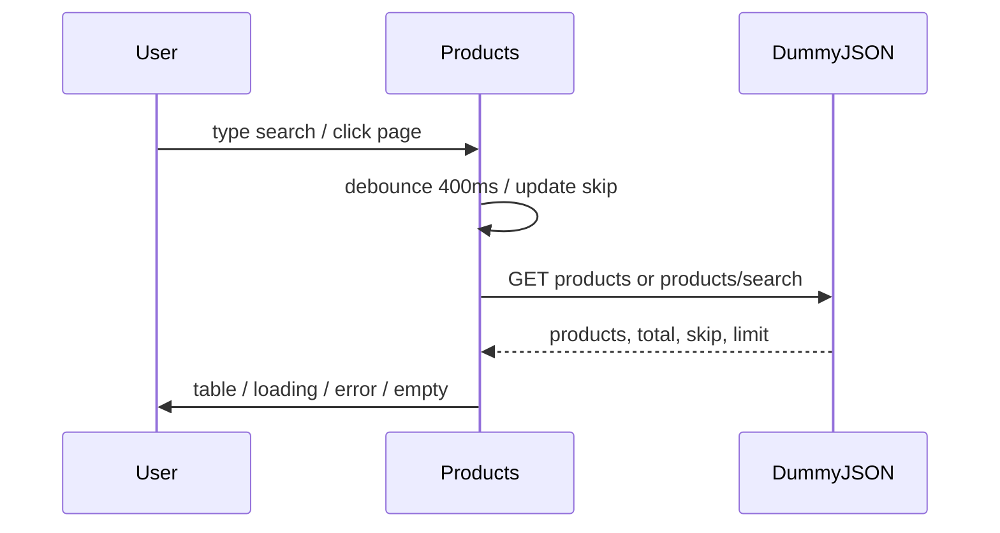

# NS-44 AI Review — Final Pass

**Story:** NS-44 Product List  
**Execution:** `exec-14782c8a-980c-4472-ab3f-d73c99789ac2`  
**Branch:** `feature/KAN-5-recent-users-on-dashboard`  
**Reviewer:** ai-reviewer (final pass)

---

## Handoff Status

| Artifact | Status |
|----------|--------|
| [implementation_planner.json](.opencode/executions/exec-14782c8a-980c-4472-ab3f-d73c99789ac2/handoffs/implementation_planner.json) | Not present in workspace |
| [code_implementer.json](.opencode/executions/exec-14782c8a-980c-4472-ab3f-d73c99789ac2/handoffs/code_implementer.json) | Not present in workspace |
| [ai_reviewer.json](.opencode/executions/exec-14782c8a-980c-4472-ab3f-d73c99789ac2/handoffs/ai_reviewer.json) | Not present in workspace |
| [auto_fixer.json](.opencode/executions/exec-14782c8a-980c-4472-ab3f-d73c99789ac2/handoffs/auto_fixer.json) | Not present — no auto-fix cycle ran |
| Prior review | [review-pointers-cycle-1.md](.opencode/executions/exec-14782c8a-980c-4472-ab3f-d73c99789ac2/review-pointers-cycle-1.md) — **Findings: None** |

No code changes detected between cycle 1 and final pass beyond the same working-tree diff.

---

## Scope Reviewed

| File | Status | Notes |
|------|--------|-------|
| [src/Products.js](src/Products.js) | In plan | DummyJSON fetch, 400ms debounce, server pagination, loading/error/empty/retry |
| [src/App.css](src/App.css) | In plan | +148 lines `.products-*` BEM block |
| [src/Products.test.js](src/Products.test.js) | In plan | `global.fetch` mocks; 10 API-driven tests |
| [docs/ai/stories/NS-44/spec.md](docs/ai/stories/NS-44/spec.md) | Extra (expected) | Story artifact |
| [docs/ai/stories/NS-44/implementation-plan.md](docs/ai/stories/NS-44/implementation-plan.md) | Extra (expected) | Story artifact |

**Verified unchanged (as planned):**
- [src/App.js](src/App.js) — `/products` route behind `isAuthenticated` guard (lines 75–77)
- [src/Sidebar.js](src/Sidebar.js) — `{ label: "Products", path: "/products" }` nav entry
- `productsMock` — no imports under `src/`

---

## Spec and Plan Compliance

All 11 acceptance criteria from [spec.md](docs/ai/stories/NS-44/spec.md) are satisfied:

- **API:** `GET /products` and `/products/search` with `limit`/`skip` via `URLSearchParams`; `total` drives pagination UI
- **Search:** 400ms debounce; empty query → list endpoint; non-empty → search with `encodeURIComponent`; `skip` reset on `debouncedSearch` change
- **Display:** Thumbnail (with `onError` + missing-URL fallback), title, category, price (`$X.XX`)
- **States:** Loading, error + Retry (`fetchKey` bump), empty (`No products found`)
- **Auth/nav:** Pre-existing route and sidebar link; no regressions in this diff
- **Styles:** BEM `.products-*` in `App.css` only; layout shell `App App--sidebar` + `Sidebar` preserved
- **Intentional removals:** Add Product modal, local CRUD, `toast`, `productsMock` — correctly removed per plan

Implementation aligns with [implementation-plan.md](docs/ai/stories/NS-44/implementation-plan.md) target files and steps.

---

## Validation (Final Pass Re-run)

| Check | Result |
|-------|--------|
| `npm test -- --watchAll=false src/Products.test.js` | **PASS** — 10/10 tests |
| `npm run build` | **PASS** |

Minor `act(...)` warnings on `setLoading` during async fetch (same as cycle 1); suite passes.

---

## Cycle 1 Cross-Reference

Cycle 1 reported **Findings: None** with four non-blocking advisories. Final pass re-verified the same code; no new defects introduced.

**Advisory (non-blocking — unchanged from cycle 1):**

1. Retry button visibility tested but click-to-refetch not covered; HTTP non-`ok` responses untested
2. `search resets pagination to page 1` test mocks page-2 data on initial load without advancing `skip` — under-exercises reset logic (implementation logic is correct)
3. React `act` warnings during fetch lifecycle
4. On `debouncedSearch` change while `skip > 0`, one fetch may briefly use stale `skip` before reset effect runs; mitigated by `AbortController`

These remain advisory; they do not block merge.

---

## Findings: None

Implementation matches [docs/ai/stories/NS-44/spec.md](docs/ai/stories/NS-44/spec.md) and [docs/ai/stories/NS-44/implementation-plan.md](docs/ai/stories/NS-44/implementation-plan.md). **Approved for merge** from a code-review perspective.

**Recommended manual smoke:** Login → Sidebar → Products → search → paginate → verify API `total` in pagination label → logout redirect.
