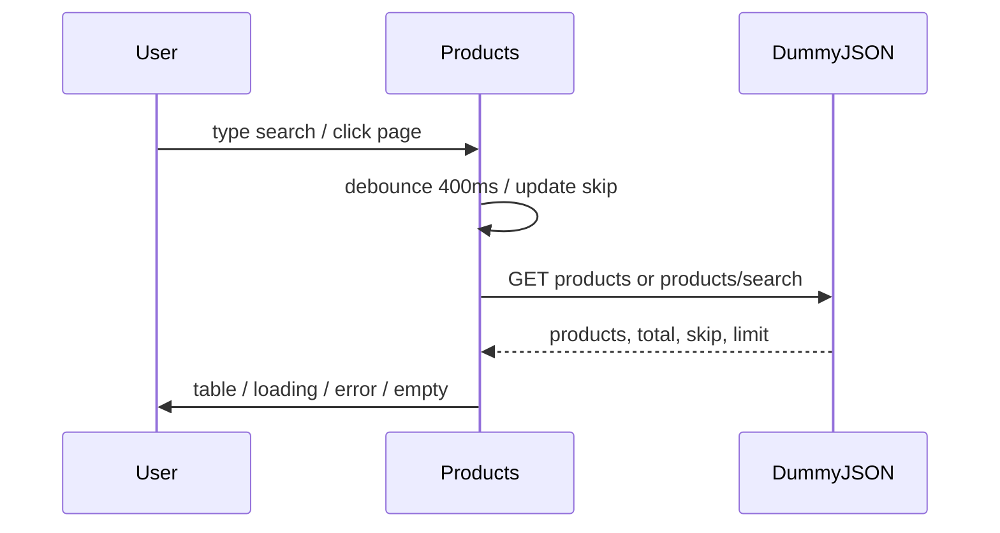

# NS-44 AI Review — Cycle 1

**Story:** NS-44 Product List  
**Execution:** `exec-14782c8a-980c-4472-ab3f-d73c99789ac2`  
**Branch:** `feature/KAN-5-recent-users-on-dashboard`  
**Reviewer:** ai-reviewer (cycle 1)

---

## Scope Reviewed

| File | Status | Notes |
|------|--------|-------|
| [src/Products.js](src/Products.js) | In plan | Mock/CRUD removed; DummyJSON fetch, debounce, pagination, states |
| [src/App.css](src/App.css) | In plan | +148 lines `.products-*` BEM block |
| [src/Products.test.js](src/Products.test.js) | In plan | `global.fetch` mocks; 10 API-driven tests |
| [docs/ai/stories/NS-44/spec.md](docs/ai/stories/NS-44/spec.md) | Extra (expected) | Story artifact; pipeline output, not app code |
| [docs/ai/stories/NS-44/implementation-plan.md](docs/ai/stories/NS-44/implementation-plan.md) | Extra (expected) | Story artifact; pipeline output, not app code |

**Out of scope (unchanged, as planned):** [src/App.js](src/App.js) (`/products` route), [src/Sidebar.js](src/Sidebar.js) (nav link). Verified present. `productsMock` no longer imported anywhere under `src/`.

---

## Spec & Plan Compliance

### Functional requirements (met)

- **API integration:** Direct `fetch` to `https://dummyjson.com/products` and `/products/search` with `limit`/`skip` via `URLSearchParams`.
- **Search:** 400ms debounce; empty query uses list endpoint; non-empty uses search with `encodeURIComponent`; `skip` reset on `debouncedSearch` change via dedicated `useEffect`.
- **Pagination:** Server-driven from API `total`; `currentPage = floor(skip/pageSize)+1`; Previous/Next update `skip`; range display `Showing X–Y of {total}`.
- **Columns:** Thumbnail (with `onError` + missing-URL fallback), title, category, price (`$X.XX`).
- **States:** Loading, error + Retry (`fetchKey` bump), empty (`No products found`).
- **Auth/nav:** Pre-existing route and sidebar entry; no regressions required in this diff.
- **Styles:** BEM `.products-*` classes in `App.css` only; layout shell `App App--sidebar` + `Sidebar` preserved.

### Intentional removals (in plan)

- Add Product modal, local CRUD, `toast`, `productsMock` import — correctly removed for read-only API list.

### Acceptance criteria mapping

All 11 acceptance criteria from [spec.md](docs/ai/stories/NS-44/spec.md) are satisfied by the changed code plus pre-existing routing/nav.

---

## Validation

| Check | Result |
|-------|--------|
| `npm test -- --watchAll=false src/Products.test.js` | **PASS** — 10/10 tests |
| `npm run build` | **PASS** |

---

## Architecture Notes

Fetch lifecycle uses `AbortController` on dependency change and `fetchKey` for explicit retry — aligns with plan risk mitigation.

---

## Advisory (non-blocking)

These do **not** require fix before merge:

1. **Test coverage gaps:** Retry button is asserted visible but click-to-refetch is untested; HTTP non-`ok` responses (`res.status`) untested; missing-thumbnail-without-`onError` untested.
2. **Weak pagination-reset test:** `search resets pagination to page 1` mocks page-2 data on initial load without advancing `skip` to 10 — passes `skip=0` trivially; real skip-reset logic in `useEffect([debouncedSearch])` is correct but under-exercised.
3. **React `act` warnings:** Test run emits `setLoading` not wrapped in `act` warnings; suite still passes.
4. **Search + skip ordering:** On `debouncedSearch` change while `skip > 0`, one fetch may fire with stale `skip` before `setSkip(0)`; mitigated by `AbortController` cleanup and unlikely to surface wrong data in practice.

---

## Findings: None

Implementation matches [docs/ai/stories/NS-44/spec.md](docs/ai/stories/NS-44/spec.md) and [docs/ai/stories/NS-44/implementation-plan.md](docs/ai/stories/NS-44/implementation-plan.md). Target files only in `src/`; story docs are expected pipeline artifacts. Build and Products tests pass. **Approve for merge** from a code-review perspective.

---

## Handoff Gaps

- `implementation_planner.json` and `code_implementer.json` handoffs were not present under `.opencode/executions/.../handoffs/` in workspace; review relied on budgeted diff, spec, and plan.
