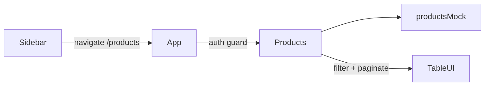

# DS-05 Final Review — Products Page

## Verdict

**Approve** — Ready to merge from a functional and spec-compliance perspective.

## Scope Review

| Area | Assessment |
|------|------------|
| Planned targets | [`src/productsMock.js`](src/productsMock.js), [`src/Products.js`](src/Products.js), [`src/App.js`](src/App.js), [`src/Sidebar.js`](src/Sidebar.js) — all present and scoped correctly |
| [`src/App.css`](src/App.css) | Not modified — correct per plan (reuse existing table/pagination classes) |
| Extra: [`docs/ai/stories/DS-05/implementation-plan.md`](docs/ai/stories/DS-05/implementation-plan.md) | Planner/implementer artifact; acceptable documentation, not src scope creep |
| Extra: [`docs/ai/stories/DS-05/spec.md`](docs/ai/stories/DS-05/spec.md) | Story spec (untracked); expected for DS-05 folder |
| Out of scope | No backend calls, no unrelated page edits, no new frameworks |

Prior reviewer/auto-fixer handoffs: **none** (first review pass).

## Acceptance Criteria

| ID | Status | Evidence |
|----|--------|----------|
| AC-1 | Pass | [`Sidebar.js`](src/Sidebar.js) — Products nav item with `fa-solid fa-box`, same button/nav pattern as Dashboard/Orders/Customers |
| AC-2 | Pass | `navigate("/products")` via react-router; route registered in [`App.js`](src/App.js) |
| AC-3 | Pass | Table columns: SKU/ID, Name, Category, Price (`formatPrice`) |
| AC-4 | Pass | Data from [`productsMock.js`](src/productsMock.js) only; no `fetch`/XHR in Products |
| AC-5 | Pass | Controlled search input; `useMemo` filter on mock array |
| AC-6 | Pass | `PAGE_SIZE = 10`; prev/next pagination when results exist |
| AC-7 | Pass | `filteredProducts` sliced for pages; `useEffect` resets `currentPage` on `searchTerm` change |
| AC-8 | Pass | `orders-no-results` message when filter empty (same pattern as [`Customers.js`](src/Customers.js)) |
| AC-9 | Pass | `npm run build` — **Compiled successfully** (verified this review) |

## Implementation Quality

- **Pattern parity**: [`Products.js`](src/Products.js) mirrors Customers (shell, search, table, pagination, empty state, auth via App route guard).
- **Mock data**: 20 products (≥18 required); varied names/categories for search/pagination demos.
- **Auth**: `/products` route uses same `isAuthenticated` + `<Navigate to="/login" />` guard as `/orders` and `/customers`.
- **Active nav**: `location.pathname === item.path` highlights Products when on `/products`.

## Non-blocking Notes (not counted as findings)

- Reuses `customers-container` / `customers-title` CSS class names on Products page — intentional per implementation plan.
- Empty search shows table headers + empty tbody + message — consistent with Customers, not a regression.
- [`docs/ai/context-map.json`](docs/ai/context-map.json) `knownPaths` omits `/products` and `agentNotes` still mention pushState — pre-existing doc drift; outside DS-05 code scope.
- Working tree: `App.js` / `Sidebar.js` unstaged; new files untracked — commit hygiene only.

## Findings

Findings: None

## Recommendation

Proceed to commit/PR. Stage all DS-05 src files together (`App.js`, `Sidebar.js`, `Products.js`, `productsMock.js`) plus story docs if the team tracks them in-repo.

