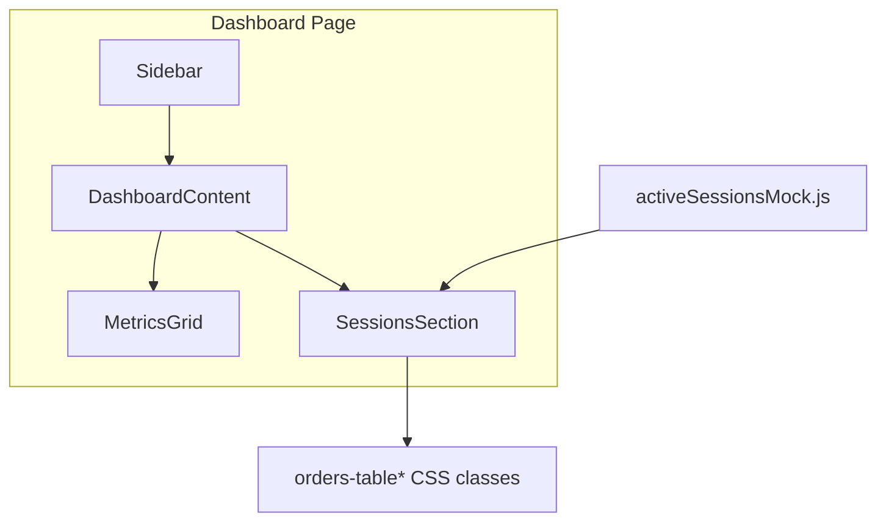

# TAX-01 Final Review Summary

## Verdict

**Approve** — ready to merge after standard pre-merge checks (`npm test`, `npm run build`) and staging/commit of untracked files.

## Story

| Field | Value |
|-------|-------|
| Key | TAX-01 |
| Title | Add Active Sessions table on dashboard |
| Scope | UI-only; Dashboard (`/dashboard`); 5 static mock rows |

## Handoff Status

| Step | Status |
|------|--------|
| implementation_planner | Completed — plan at [`docs/ai/stories/TAX-01/implementation-plan.md`](docs/ai/stories/TAX-01/implementation-plan.md) |
| code_implementer | Completed — 5 target files changed |
| ai_reviewer (prior) | Missing — no prior findings to carry forward |
| auto_fixer | Missing — no fix cycle |

## Changed Files Review

| File | Verdict | Notes |
|------|---------|-------|
| [`src/activeSessionsMock.js`](src/activeSessionsMock.js) | In scope | Exports exactly 5 records with `id`, `user`, `status`, `lastActive` — matches [`src/productsMock.js`](src/productsMock.js) / [`src/mastersMock.js`](src/mastersMock.js) pattern |
| [`src/Dashboard.js`](src/Dashboard.js) | In scope | Imports mock data; preserves metrics grid; adds Active Sessions section below grid |
| [`src/App.css`](src/App.css) | In scope | Minimal `.dashboard-sessions` layout rule (`max-width: 1100px`, padding aligned with `.orders-container`) |
| [`src/Dashboard.test.js`](src/Dashboard.test.js) | In scope | Follows [`src/Orders.test.js`](src/Orders.test.js) pattern (`MemoryRouter`, render assertions) |
| [`docs/ai/stories/TAX-01/spec.md`](docs/ai/stories/TAX-01/spec.md) | Expected artifact | SDLC story spec — not scope creep |
| [`docs/ai/stories/TAX-01/implementation-plan.md`](docs/ai/stories/TAX-01/implementation-plan.md) | Expected artifact | SDLC plan — not scope creep |

**Out-of-scope files:** None edited (`App.js`, `Sidebar.js`, auth, routing untouched).

## Requirements vs Acceptance Criteria

| Criterion | Status | Evidence |
|-----------|--------|----------|
| Active Sessions section with clear heading on `/dashboard` | Pass | `h2.orders-title` with text "Active Sessions" in [`src/Dashboard.js`](src/Dashboard.js) |
| Exactly 5 mock session records | Pass | [`src/activeSessionsMock.js`](src/activeSessionsMock.js) has 5 entries; full `.map()` with no slice/filter |
| Rows include user, status, last active | Pass | Three columns rendered: User, Status, Last Active |
| No API / network calls | Pass | Static import only; no `fetch`, effects, or handlers |
| Consistent styling with existing tables | Pass | Reuses `orders-title`, `orders-table-wrapper`, `orders-table`, `orders-table-th`, `orders-table-td` (same as [`src/Orders.js`](src/Orders.js)) |
| No Dashboard regressions | Pass | Metrics grid unchanged; test asserts all four metric labels |
| `npm run build` succeeds | Not verified in review | Recommend running before merge (per spec AC) |

## Implementation Quality

**Strengths:**
- Follows established Orders table markup and CSS class reuse
- Mock data extracted to dedicated module (consistent with project mock pattern)
- React `key={session.id}` on rows
- Tests wrap in `MemoryRouter` (required by `Sidebar` router hooks); no `localStorage` mock needed — `Sidebar` does not read storage
- Layout CSS scoped to `.dashboard-sessions` without duplicating table rules

**Non-issues (reviewed and dismissed):**
- Shared demo names (Alice Johnson, Bob Smith, etc.) overlap with Orders mock data — acceptable for static demos
- Tests assert user names but not status/lastActive strings — minor coverage gap; UI code renders both columns correctly and AC is met functionally
- Changes currently unstaged/untracked — workflow item, not a code defect

## Prior Review Findings

None — prior `ai_reviewer` handoff was missing; no R1/R2 IDs to reference.

## Findings

Findings: None

## Pre-Merge Checklist

1. Stage and commit: `src/activeSessionsMock.js`, `src/Dashboard.js`, `src/App.css`, `src/Dashboard.test.js` (and docs if desired for the branch)
2. Run `npm test -- --watchAll=false` (or project CI equivalent)
3. Run `npm run build`
4. Manual smoke: authenticate → `/dashboard` → confirm 5-row table below metrics grid
