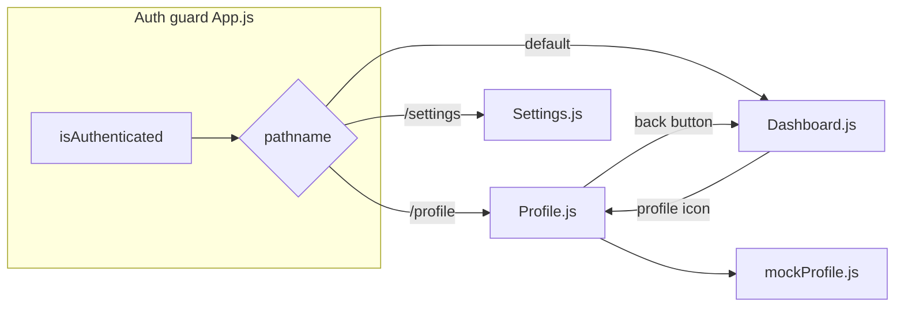

# DS-01 Profile Page — Final Review Summary

## Verdict

**Approve** — Implementation matches [docs/ai/stories/DS-01/spec.md](docs/ai/stories/DS-01/spec.md) and [docs/ai/stories/DS-01/implementation-plan.md](docs/ai/stories/DS-01/implementation-plan.md). No blocking or non-blocking code findings.

Findings: None

---

## Scope Reviewed

| Category | Files |
|----------|-------|
| Planned implementation | [src/App.js](src/App.js), [src/Dashboard.js](src/Dashboard.js), [src/Profile.js](src/Profile.js), [src/mockProfile.js](src/mockProfile.js), [src/App.css](src/App.css) |
| Planning artifacts (expected, not app code) | [docs/ai/stories/DS-01/spec.md](docs/ai/stories/DS-01/spec.md), [docs/ai/stories/DS-01/implementation-plan.md](docs/ai/stories/DS-01/implementation-plan.md) |
| Pipeline noise (exclude from product commit) | `.opencode/executions/exec-e22ee9fd-f9b1-4f41-ac28-67aecb11c14c/*` |

Prior `ai_reviewer` and `auto_fixer` handoffs were absent (no prior R-IDs to carry forward).

---

## Acceptance Criteria

| ID | Status | Evidence |
|----|--------|----------|
| AC-1 | Pass | Profile icon lives only in [src/Dashboard.js](src/Dashboard.js) `dashboard-nav`. Logged-out users render `Login`/`Register` via [src/App.js](src/App.js) `renderView()` — never `Dashboard`. |
| AC-2 | Pass | Profile button with `fa-circle-user`, `aria-label="View profile"`, `navigateTo("/profile")`. |
| AC-3 | Pass | [src/App.js](src/App.js) branch: `pathname === "/profile"` → `<Profile navigateTo={navigateTo} />`. |
| AC-4 | Pass | [src/Profile.js](src/Profile.js) is read-only (`dl` + values); no inputs or save actions. |
| AC-5 | Pass | Fields: display name, email, username, role, member since, bio; initials avatar when `avatarUrl` is null. |
| AC-6 | Pass | Data from [src/mockProfile.js](src/mockProfile.js) only; no `fetch`/XHR in `src/`. |
| AC-7 | Pass | Auth guard unchanged (`isAuthenticated` + redirect to `/login`); back button `navigateTo("/dashboard")`; `popstate` listener preserved. Unauthenticated `/profile` redirects to login. |
| AC-8 | Pass | `npm run build` — **Compiled successfully** (verified this review). |

---

## Implementation Quality

**Patterns (correct):**
- Matches `Settings.js` card shell (`login-container`, `login-card`, `settings-back-btn`).
- Mock values align with Settings defaults (`Jane Doe`, `jane@example.com`).
- Adds shared `.profile-btn` / `.settings-btn` nav styles (HEAD had no `settings-btn` rules — improves settings gear styling too).

**Known accepted limitations (per plan, not defects):**
- Profile icon only on Dashboard, not on `/settings` or `/profile` views — documented in plan risks.
- Static `mockProfile.js` does not read `registeredUsers` from localStorage — optional stretch per spec; static mock is in scope.

---

## Extra Changed Files

`.opencode/executions/...` (execution.json, logs, context-packs, cursor-streams, handoffs) are SDLC pipeline artifacts, not product code. **Not scope creep in `src/`** — stage only `src/*` and story docs when committing.

---

## Validation Performed

- Read context pack, planner/implementer handoffs, target source files.
- `npm run build` — success.
- Grep `src/` — no network client usage for profile data.

**Not run (optional smoke):** `npm start` manual click-through per plan validation section.

---

## Recommendation

Merge-ready for DS-01 feature scope. No auto-fixer cycle required.

When committing, limit to: `src/App.js`, `src/App.css`, `src/Dashboard.js`, `src/Profile.js`, `src/mockProfile.js`, and optionally `docs/ai/stories/DS-01/*` — omit `.opencode/` execution history unless your workflow intentionally tracks it.
